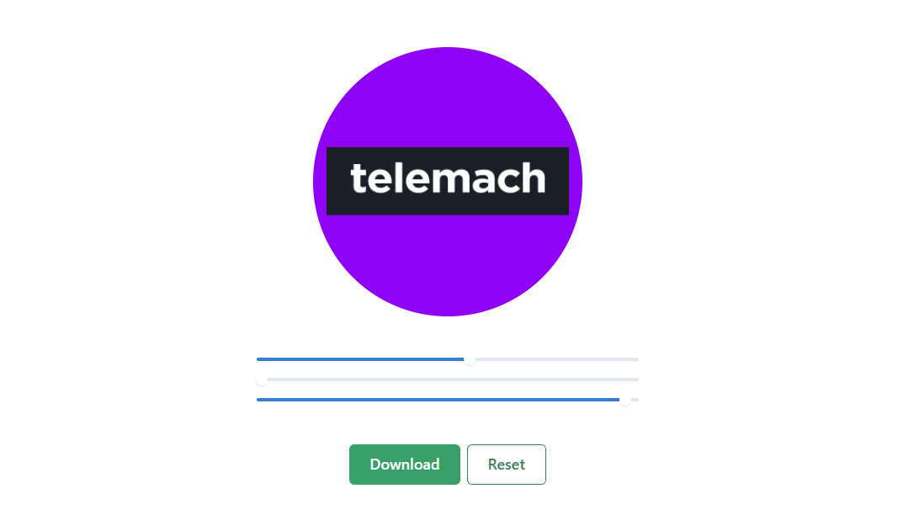

# Telemach Skittles

> Logo creator for Telemach employees

Project built for Telemach employees to make them create avatar for gmail account easier. Just select colors and download .png ready to use.

_Live demo: [telemach-skittles.netlify.app](https://telemach-skittles.netlify.app/)_



## Installation

OS X & Linux & Windows:

```sh
npm install
```

## Usage

Main idea was to make Telemach employees life easier.

## Release History

- 0.0.1
  - Simple functionality, select color and download ready-to-use .png file

## Contributing

1. Fork it (<https://github.com/jorgadev/telemach-skittles/fork>)
2. Create your feature branch (`git checkout -b feature/fooBar`)
3. Commit your changes (`git commit -am 'Add some fooBar'`)
4. Push to the branch (`git push origin feature/fooBar`)
5. Create a new Pull Request
